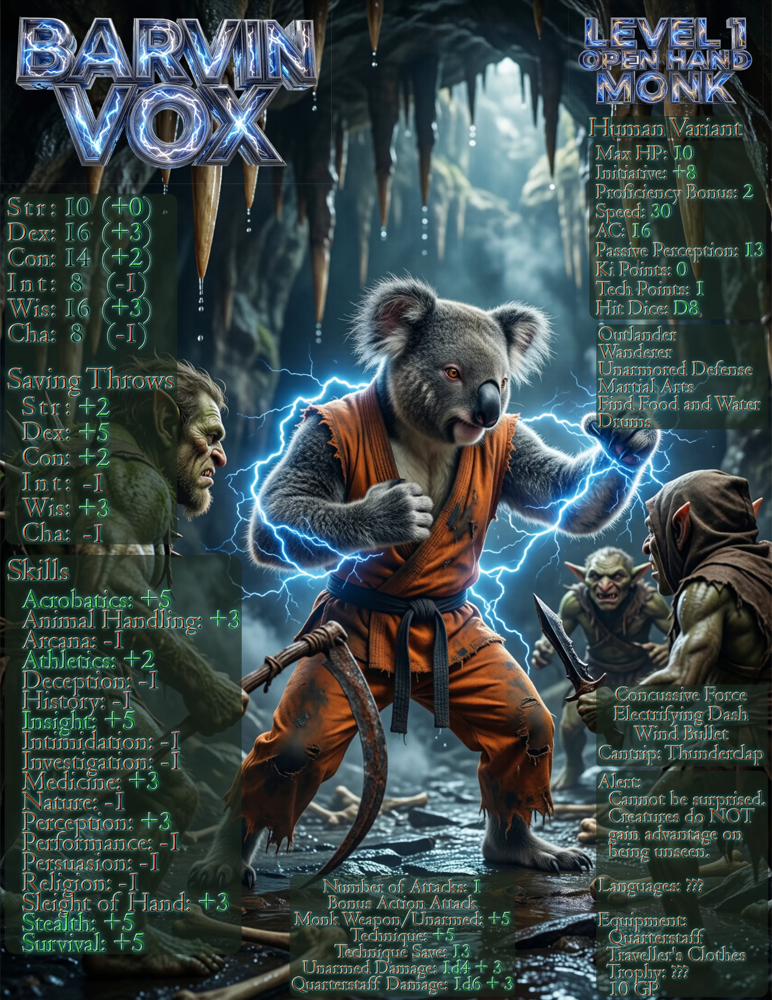
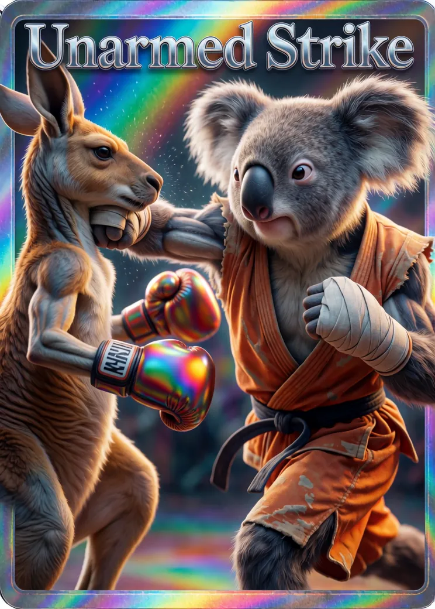
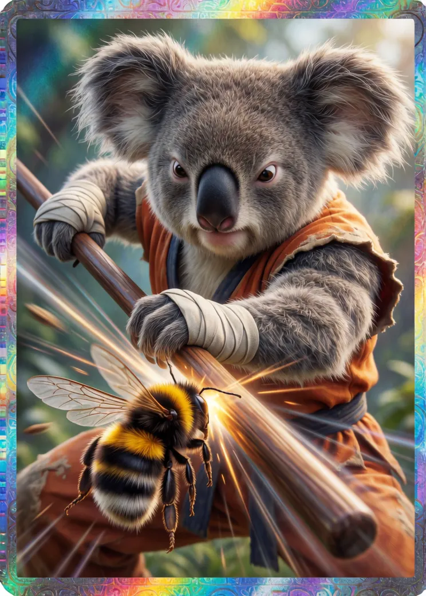
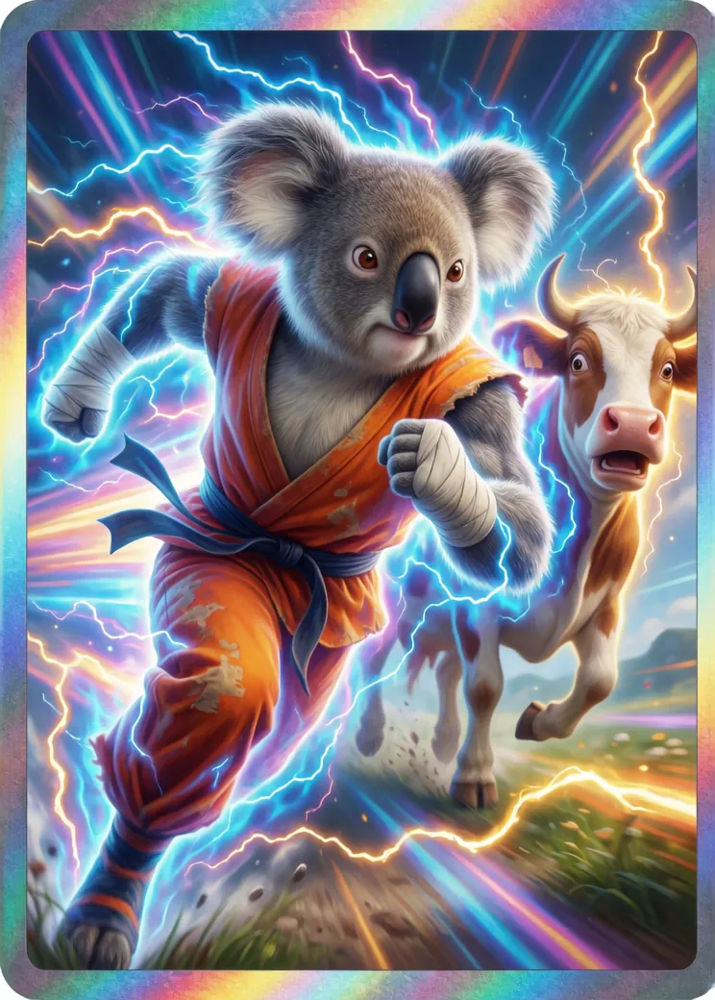
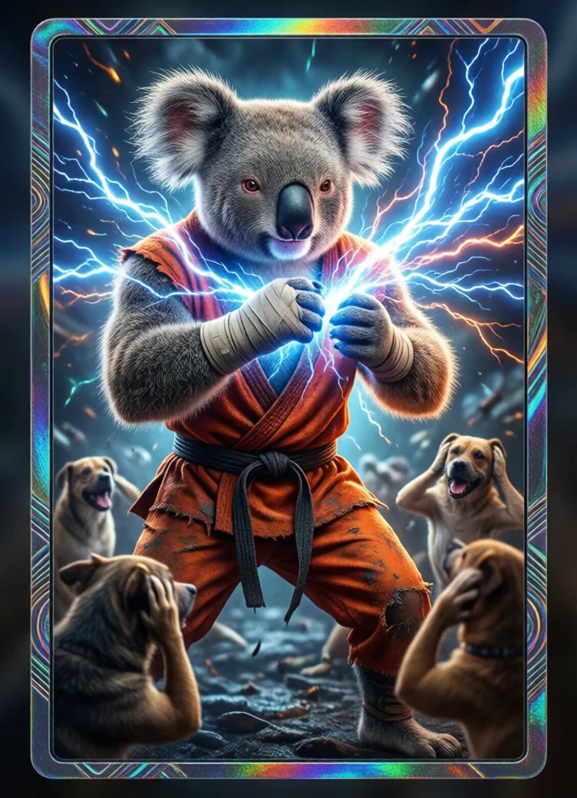
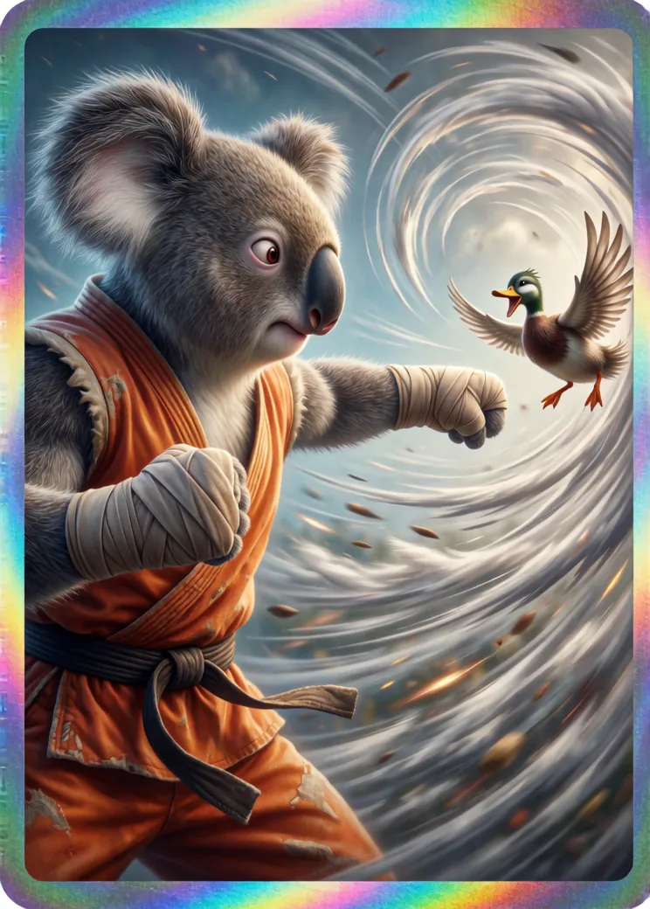

# Barvin Vox

## Level 1 Stats



Change this to a more web-friendly character sheet.

# .md table example

| Stat | Value | Description |
| :--- | :---- | ----------- |
| HP   | 10    | Health      |
| Ki   | 0     | Pow!        |

## Backstory

Blah blah blah blah blah blah blah blah blah blah blah blah blah blah blah blah blah blah blah blah blah blah blah blah blah blah blah blah blah blah blah blah blah blah blah blah blah blah blah blah blah blah blah blah blah blah blah blah blah blah blah blah blah blah blah blah blah blah blah blah blah blah blah blah blah blah blah blah blah blah blah blah blah blah blah blah blah blah blah blah blah blah blah blah blah blah blah blah blah blah blah blah blah blah blah blah blah blah blah blah blah blah blah blah blah blah blah blah.

## Available Actions

Probably need to regen these photos with alpha to clean them up.

### Unarmed Strike



### Smack the Bee!

I don't like bees.



### Electrifying Dash



### Concussive Force


### Thunderclap



### Wind Bullet



### Number 3

#### Number 4

##### Number 5

###### Number 6

## List of formating codes:

````
# Headings: # H1 | ## H2 | ### H3 --> H6
**Emphasis:** **Bold** | *Italic* | ~~Strikethrough~~ | `Inline Code`
**Lists:** - Bullet point | 1. Ordered list
**Links/Images:** [Link Text](URL) | 

or:
<div class="portrait-container">
  
</div>

/* This targets any image inside a div with the class 'portrait-container' */
.portrait-container img {
  width: 100%;
  max-width: 400px;
  height: auto;
  display: block;
  margin: 0 auto;
}

/* and add custom styling in style.css if desired */
.portrait-container {
  text-align: center;
  padding: 20px;
  border: 1px solid #ddd;
  border-radius: 8px;
}

**Image: HTML version for more control:** 

**Quotes:** > This is a blockquote for dialogue or lore.
**Code Blocks:** ``` language ```
**Insert Video:**
<video width="100%" height="auto" controls>
  <source src="/videos/barvin_intro.mp4" type="video/mp4">
  Your browser does not support the video tag.
</video>
**Embed Youtube Video:**
<iframe
  width="100%"
  height="315"
  src="https://www.youtube-nocookie.com/embed/Pl0_eXDrtSY"
  title="YouTube video player"
  frameborder="0"
  allow="accelerometer; autoplay; clipboard-write; encrypted-media; gyroscope; picture-in-picture"
  rel=0
  allowfullscreen></iframe>
**Tables:**
| Stat | Value | Description |
| :--- | :--- | :--- |
| HP | 100 | Health |
| MP | 50 | Mana |
**Horizontal Rule:** ---
**Admonitions:**
::: info (text etc):::
::: tip
::: warning
::: danger
````
