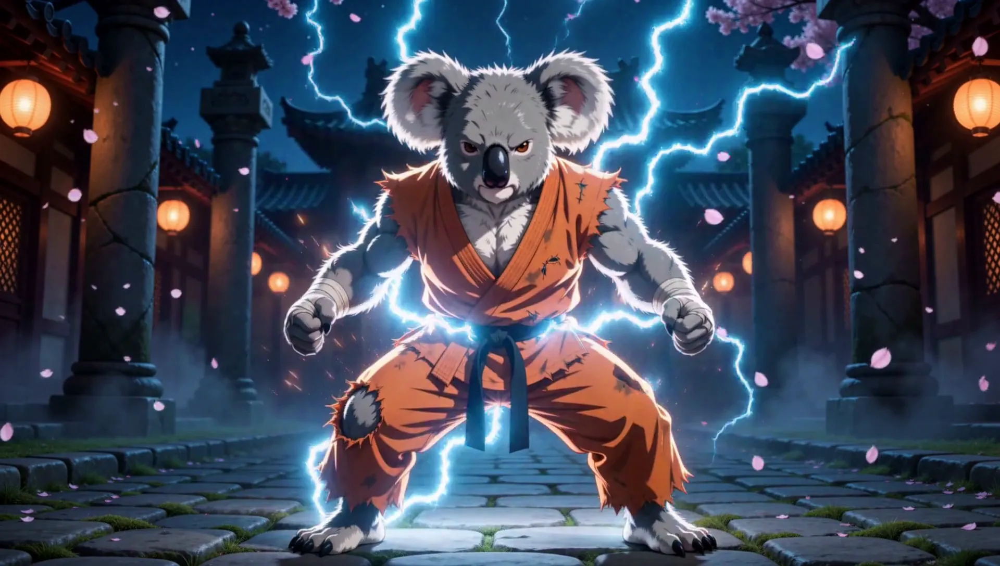
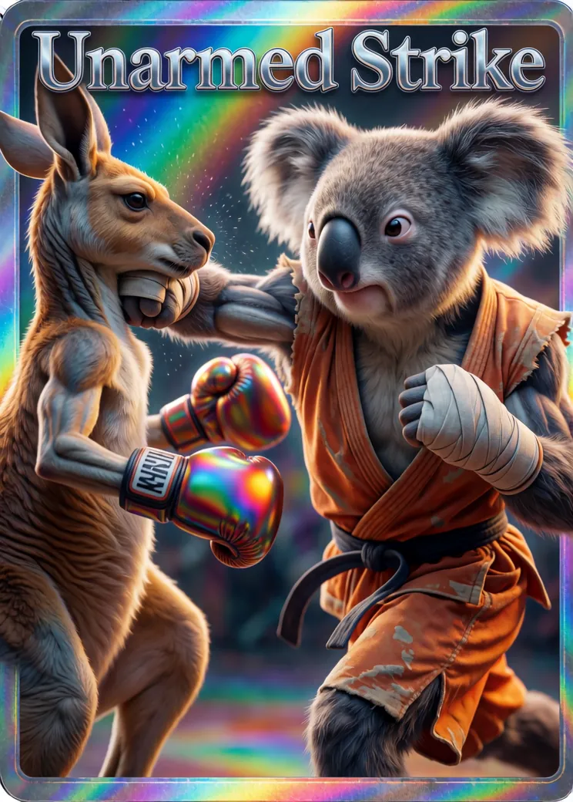
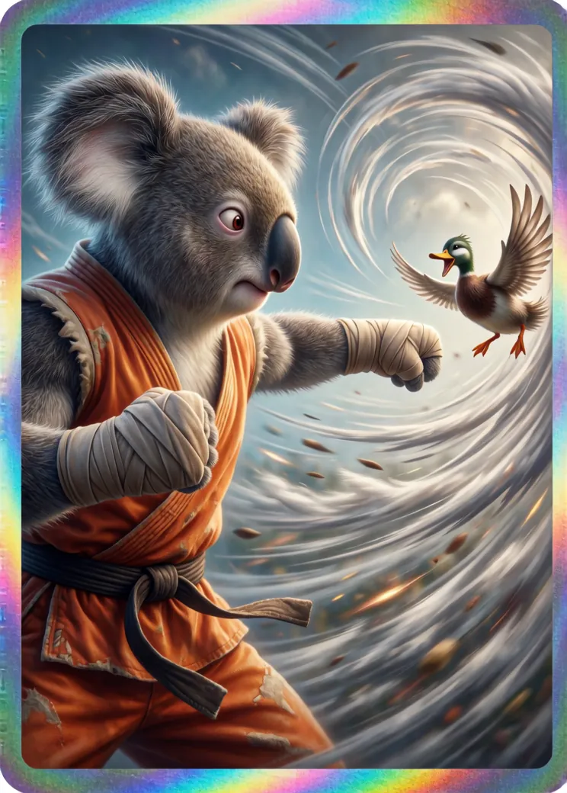
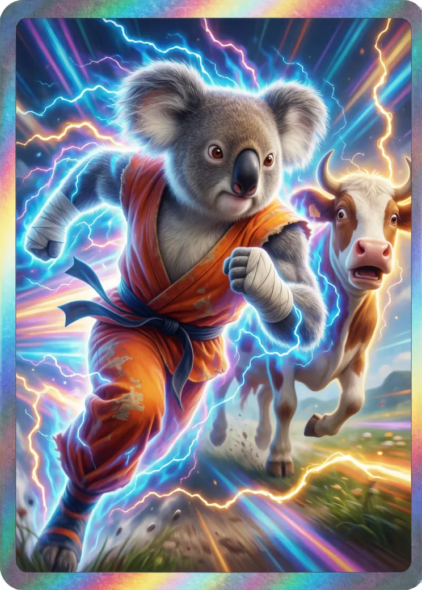

# Barvin Vox - Monk

## 📊 Core Statistics (Level 1)

## Attributes, Modifiers, and Saving Throws

| Stat    | Value        | Modifier | Saving Throw        |
| :------ | :----------- | :------- | :------------------ |
| **STR** | 10           | +0       | +2 (+2 PROF)        |
| **DEX** | 16 (+1 Race) | +3       | +5 (+3 DEX +2 PROF) |
| **CON** | 14           | +2       | +2                  |
| **INT** | 8            | -1       | -1                  |
| **WIS** | 16 (+1 Race) | +3       | +3                  |
| **CHA** | 8            | -1       | -1                  |

## Skills

| Skill                     | Bonus                             |
| :------------------------ | :-------------------------------- |
| **Acrobatics** (DEX)      | +5 (+3 DEX +2 PROF [Class])       |
| **Animal Handling** (WIS) | +3                                |
| **Arcana** (Int)          | -1                                |
| **Athletics** (Str)       | +2 (+0 Str + 2 PROF [Background]) |
| **Deception** (Cha)       | -1                                |
| **History** (Int)         | -1                                |
| **Insight** (WIS)         | +5 (+3 WIS + 2 PROF [Class])      |
| **Intimidation** (Cha)    | -1                                |
| **Investigation** (Int)   | -1                                |
| **Medicine** (WIS)        | +3                                |
| **Nature** (Int)          | -1                                |
| **Perception** (WIS)      | +3                                |
| **Performance** (Cha)     | -1                                |
| **Persuasion** (Cha)      | -1                                |
| **Religion** (Int)        | -1                                |
| **Sleight of Hand** (DEX) | +3                                |
| **Stealth** (DEX)         | +5 (+3 DEX + 2 PROF [Race Bonus]) |
| **Survival** (WIS)        | +5 (+3 WIS +2 PROF [Background])  |

> **Passives:** Passive Perception: 13 (10 Base +3 WIS Mod) | Passive Insight: 15 (10 Base +3 WIS Mod +2 PROF)

## Combat Statistics

| Combat Statistics |                                               |
| :---------------- | :-------------------------------------------- |
| Hit Points        | 10 (1d8 base +2 CON)                          |
| Armor Class       | 16 (Unarmored Devense: 10 Base +3 DEX +3 WIS) |
| Initiative        | +8 (+3 DEX +5 ALERT)                          |
| Speeed            | 30 ft. (+0 Unarmored Movement)                |
| Martial Arts      | 1d4 DMG                                       |
| Ki Points         | 0                                             |
| Technique Points  | 0                                             |
| Proficiency Bonus | +2                                            |
| Attack Bonus      | +5 (+3 DEX +2 PROF)                           |
| Ki Save DC        | 13 (8 +WIS +2 PROF)                           |
| Tech Save DC      | 13 (8 +3 DEX +2 PROF)                         |
| Spell Save DC     | 13 (8 +3 DEX +2 PROF)                         |

## Class Features & Proficiencies

| Feature                 |                                                                  |
| :---------------------- | :--------------------------------------------------------------- |
| Hit Dice                | 1d8 + CON                                                        |
| Armor Proficiency       | None                                                             |
| Weapon Proficiency      | Simple weapons, Shortswords                                      |
| Tools (CLASS)           | Cartographer's tools                                             |
| Instrument (BACKGROUND) | Drums/Percussion                                                 |
| Saving Throws           | STR and DEX (CLASS)                                              |
| Skills                  | Acrobatics, Insight (CLASS)                                      |
| Alert (BACKGROUND)      | +5 bonus to Initiative                                           |
|                         | Can't be surprised while you are conscious                       |
|                         | Other creatures don't gain advantage on attack rolls against you |
|                         | as a result of being unseen by you                               |
| Unarmored Defense       | AC = 10 +DEX +WIS                                                |
| Martial Arts            | Unarmed or Monk weapons use DEX for ATK and DMG                  |
|                         | Use Martial Arts dice for DMG                                    |
|                         | Bonus Unarmed Strike after an Unarmed Strike or Monk Weapon ATK  |
| Ki                      | Replenish on Long Rest                                           |
|                         | Must spend 30 min meditating                                     |
| Flurry of Blows         | Cost: 1 Ki Point                                                 |
|                         | Immediately after ATK, make two Unarmed Strikes as Bonus Action  |
|                         | Open Hand unlocks additional effects at lvl 3                    |
| Patient Defense         | Cost: 1 Ki Point                                                 |
|                         | Take the Dodge action as a Bonus Action this turn                |
| Step of the Wind        | Cost: 1 Ki Point                                                 |
|                         | Take the Disengage or Dash action as a Bonus Action this turn    |
|                         | Jump distance is doubled                                         |
| Unarmored Movement      | Unlocked at Level 3                                              |
|                         | Speed increases by 10 feet when Unarmored                        |
|                         | Additional speed bonus and features as you level up              |

## 🧬 Race & Background Features

### Variant Human

- **Bonus ASI:** +1 to two ability scores (DEX AND WIS)

- **Bonus Skill Proficiency:** Stealth

### Outlander (Background)

- **Skill Proficiencies:** Athletics, Survival
- **Feature: Wanderer** (Perfect memory for geography; ability to find food/water easily).
- **Tool Proficiencies:** One musical instrument: **_Drums/Percussion_**.
- **Languages:** One extra language of choice. **_Draconic_**

### Gear

- Quarterstaff (Class)
- Explorer's Pack (Class)
  - Backpack
  - Bedroll
  - Mess Kit
  - Tinderbox
  - Torches x 10
  - Rations x 10
  - Waterskin
  - Rope: 50 ft.
- Darts x 10 (Class)
- Hunting Trap (Background)
- Trophy: a tarnished lute string from home (Background)
- Traveler's Clothes (Background)
- 20 GP (+10 Background +10 Explorer's Pack)

## ⚔️ Action Menu & Techniques

### Unarmed Strike (Core Skill)

- 1d4 + 3 (DEX)
  
  _Deal 1d4 bludgeoning damage per strike. As a Monk, you can perform a bonus action Unarmed Strike after using the Attack action with your Monk Weapon or an Unarmed Strike._

### Smack the Bee! (Quarterstaff Attack)

- 1d6 + 3 (DEX)
  
  _I don't like bees._

### Thunderclap (AOE Cantrip)

- **Casting Time:** 1 Action
- **Cost:** 1 Action
- **Range/Area:** 5 ft radius (Audible up to 100 feet.)
- **CON** Save
- **Damage:** 1d6 Thunder damage on fail
  
  _Scales to +1d6 at lvl 5, +2d6 at lvl 11, +3d6 at lvl 17._

### Wind Bullet (Ranged Technique)

- **Casting Time:** 1 Attack Action (Counts as Monk Weapon???)
- **Cost:** 1 Tech Point (Replaces 1 attack)
- **Range:** 120 feet (must be able to see)
- **Bonus:** If target is not aware of your current location, add 1d4 to **Attack** roll
- **Damage:** 3d12 Piercing damage on hit.
  
  _A rapid air bullet (no sound)._

### Concussive Force (Short-Range CC Technique)

- **Casting Time:** 1 Attack Action (Counts as Monk Weapon???)
- **Cost:** 1 Tech Point (Replaces 1 attack)
- **Range:** 10 feet (Audible up to 300 feet.)
- **CON** Save
- **Damage:**
  - 4d6 Thunder DMG
  - Knocked back 15 feet
  - Knocked prone
  - Deafened until the end of your next turn

_Loud AF._

### Electrifying Dash (Movement Technique)

- **Casting Time:** Instantaneous (start of turn)
- **Duration:** Until the end of turn
- **Cost:** 1 Tech Point
- **Bonus:**
  - +20 Movement Speed
  - Don't provoke Opportunity Attacks
- **DEX** Save
- **Damage:** 1d8 Lightning on fail (Half DMG on Save)
  - Damage is calculated at end of turn against any creature that was within 5 feet of you since you invoked this technique

_Fast AF._

## ✨ Personality & Traits

Barvin is a gentle and strangely hopeful soul, often characterized by a "dopey charm." This demeanor is not true innocence but rather a protective armor designed to mask the hollow space he carries within. He is naive, quick to trust, and slow to understand complex social nuances—though it is remarkably hard to deceive him.

He lives in a constant state of apology, often trying to help even when he doesn't fully grasp what is happening around him. A side effect of his unique nature is a history of mild narcolepsy; he frequently falls asleep without warning and occasionally sleepwalks. However, beneath this gentle exterior, a latent power stirs: whenever danger rises, the internal "thunder" within him begins to wake.

## 📜 Lore & History

### I. Origins: The Isolated Years

Barvin was born to Merrik and Velda Vox on a small farm deep in the isolated countryside outside of Mayua. His family were dirt-poor farmers who lived in self-imposed isolation, driven by a radical "sovereign citizen" desire for total independence from outside influence. They lived in a dilapidated shack that was little more than a sun-bleached shell on the verge of collapse.

Barvin was born blind and constantly struggled with daydreaming. Because he could not see, he often didn't know if he was asleep or awake; he would frequently wake up to find himself miles away from safety. This lack of awareness terrified his parents, who viewed him as a burden—and ultimately as "unworthy" and "tainted." They beat him for failing to pay attention and starved him because they viewed him as an unproductive consumer who wasted the precious food they struggled to produce. He didn't complain or fight back, which only unsettled them further; they eventually began locking him in a cellar to keep his wandering out of sight.

He learned to perceive the world through sounds and vibrations—the buzz of insects, the creak of floorboards, and even the tremor of another's heartbeat. He grew up believing everyone perceived reality this way, while also believing that hunger, pain, and desertion were perfectly normal conditions of life.

His only friend was **Talann**, a girl from next door who taught him to walk quietly, discern truth from lies by voice vibrations, and what music felt like. They spent afternoons making up songs—she with her half-rotted lute and he thumping rhythms on rocks with his walking stick. When she vanished at age nine, his parents claimed she had run off. Barvin believed them, though no neighbors would speak of it, and his memory of her has since faded.

### II. The Trauma & Transformation

At age eleven, during a massive storm, his parents—members of a secret cult who knew of the twin Gods Hurun and Nurun—dragged him into their barn. They were obsessed with how these twin gods had once healed Taranis Guthrie, who had been paralyzed in a wheelchair; they believed that the twins might "fix" Barvin as well.

They tied him down onto a hay bale and began carving symbols of their god into his skin with a knife. Something answered from the thunderhead—not the deity they sought, but something flickering like a dying lantern. As it approached, lightning shattered the barn. In the confusion, Barvin seized the bloody knife, cut himself free, and fled into the woods.

Sensing this presence for the first time, real terror struck him. He ran until he reached a large field where a massive bolt of lightning struck him point-blank. He did not die or burn; instead, air around him exploded outward, flattening nearby crops. When he eventually woke miles away in the city proper, his perception had fundamentally shifted. He could now "read" vibrations with terrifying detail—feeling the pulse of the earth and the secrets of the air. It overwhelmed and amazed him to truly "see" for the first time, yet it left him with a permanent echo of terror rumbling inside his chest.

### III. The Order of the Resonant Path

Barvin was taken in by the Order of the Resonant Path near Enziret. They sensed something fractured inside of him—not a blessing or a curse, but a wound. Despite this, he was allowed to train with the monks.

While he was adept at fighting due to his lack of fear, he struggled deeply with their discipline; he would fall asleep during meditations and forget complex forms. He was often picked on by other students because he apologized so readily and trusted people too easily—a trait that frequently led others to take advantage of him.

However, his deepened perception gave him distinct advantages: he could hear footsteps through stone and "see" intent through the tension in a person's posture. Occasionally, when striking with true focus, the air around him would crack like a thunderclap. The monks were both curious and fearful, whispering that he felt "hollow," as if something else were listening through him.

One night, during a meditation exercise, Barvin collapsed into a deep sleep while standing upright. As internal pressure built like water against a dam, it reached critical mass. A thunderclap—like a mountain cracking in half—ripped through the air, shattering stone buildings and toppling statues. The shockwave killed one student instantly and left many others broken with shattered bones. Terrified of his power, the monks expelled him, telling him that "whatever echoes inside of you is waking up."

### IV. The Wandering Years & Current Status

Barvin spent years running from city to city:

- **Zanzibahar:** He worked the docks, listening to the ocean through the sand while sailors whispered that storms changed direction when he slept.
- **Urusha:** He fought in underground pits for spectacle, marveling at the fear his thunderous fists inspired.
- **Nyalima:** The priests of Nyota refused him entry, claiming his internal rhythm was "backward," like a drumbeat played backward—an echo with no source.
- **Mayua:** He returned to the farmlands of his birth (never approaching his home), where he found himself followed by curious or afraid fey creatures moving through the soil.

**Current Status:** While heading toward Enziret, hoping for some peace, Barvin felt the earth shake as a mountain erupted. As it happened, he heard a scream unlike anything in his lifetime. In that moment, the hollow space inside him tore open wide. He woke as a refugee in **Rockfall**, surrounded by refugees whispering about Enzi's absence and something crawling through the smoke. Barvin now considers: is whatever echoes within him connected to the gods themselves?

---

## 👁️ Sensory Mechanics

Barvin does not "see" in the traditional sense. He processes information through:

- **Navigation (Vibration Map):** Taps surfaces (walls, floors, boots) with fingers/staff to perceive room layouts and object proximity.
- **Echolocation:** Hums low, rhythmic tones to "ping" and map the environment.
- **Perception Style:** Tilts head like an animal; aims ears at targets rather than eyes. 100% visual focus is replaced by auditory vibration mapping.
- **Verbalized Narrative:** Narrates external sounds (heartbeats, dripping water) out loud as a form of processing sensory input.
- **Sleepwalking Mechanic:** Moves with perfect monk-like balance while unconscious or sleepwalking.

---

## 📈 Progression & End-Game Stats **_(PRELIMINARY)_**

| LEVEL | PROF BNS | MARTIAL ARTS | KI POINTS | TECH POINTS | UNARMORED MVT | FEATURES                                | TECHNIQUES                                       |
| :---- | :------- | :----------- | :-------- | :---------- | :------------ | :-------------------------------------- | :----------------------------------------------- |
| 1     | +2       | 1d4          | 0         | 0           | +0 ft.        | Unarmored Defense, Martial Arts         | Thunderclap                                      |
| 2     | +2       | 1d4          | 2         | 0           | +10 ft.       | Ki, Unarmored Movement                  |                                                  |
| 3     | +2       | 1d4          | 2         | 1           | +10 ft.       | Way of the Open Hand, Deflect Missiles  | Wind Bullet, Concussive Force, Electrifying Dash |
| 4     | +2       | 1d4          | 3         | 1           | +10 ft.       | ASI, Slow Fall                          |                                                  |
| 5     | +3       | 1d6          | 3         | 2           | +10 ft.       | Extra Attack, Stunning Strike           | Zephyr Rush                                      |
| 6     | +3       | 1d6          | 4         | 2           | +15 ft.       | Ki-Empowered Strikes, Wholeness of Body |                                                  |
| 7     | +3       | 1d6          | 5         | 2           | +15 ft.       | Evasion, Stillness of Mind              |                                                  |
| 8     | +3       | 1d6          | 6         | 2           | +15 ft.       | ASI                                     |                                                  |
| 9     | +4       | 1d6          | 7         | 2           | +15 ft.       | Unarmored Mvt Improvement               |                                                  |
| 10    | +4       | 1d6          | 8         | 2           | +20 ft.       | Purity of Body                          |                                                  |
| 11    | +4       | 1d8          | 8         | 3           | +20 ft.       | Tranquility                             | Twisting Strike                                  |
| 12    | +4       | 1d8          | 9         | 3           | +20 ft.       | ASI                                     |                                                  |
| 13    | +5       | 1d8          | 10        | 3           | +20 ft.       | Tongue of the Sun and Moon              |                                                  |
| 14    | +5       | 1d8          | 11        | 3           | +25 ft.       | Diamond Soul                            |                                                  |
| 15    | +5       | 1d8          | 12        | 3           | +25 ft.       | Timeless Body                           |                                                  |
| 16    | +5       | 1d8          | 13        | 3           | +25 ft.       | ASI                                     |                                                  |
| 17    | +6       | 1d10         | 13        | 4           | +25 ft.       | Quivering Palm                          | Air Vortex                                       |
| 18    | +6       | 1d10         | 14        | 4           | +30 ft.       | Empty Body                              |                                                  |
| 19    | +6       | 1d10         | 15        | 4           | +30 ft.       | ASI                                     |                                                  |
| 20    | +6       | 1d10         | 16        | 4           | +30 ft.       | Perfect Self                            |                                                  |

### VIII. FINAL STAT BLOCK (LEVEL 20) _(Preliminary)_

| Attribute | Value | Modifier | Calculation / Source                              |
| :-------- | :---- | :------- | :------------------------------------------------ |
| **STR**   | 10    | +0       | Base 10 + 0 Racial                                |
| **DEX**   | 20    | +5       | Base 15 + 1 Variant Human + 4 ASI [Levels 4, 8]   |
| **CON**   | 14    | +2       | Base 14 + 0 Racial                                |
| **INT**   | 8     | -1       | Base 8 + 0 Racial                                 |
| **WIS**   | 20    | +5       | Base 15 + 1 Variant Human + 4 ASI [Levels 12, 16] |
| **CHA**   | 8     | -1       | Base 8 + 0 Racial                                 |

| Combat & Resource Totals       | Value   | Details                             |
| :----------------------------- | :------ | :---------------------------------- |
| **Final Ki Pool**              | 16      |                                     |
| **Technique Points Available** | 4       |                                     |
| **AC (Unarmored Defense)**     | 20      | Base 10 + 5 DEX + 5 WIS             |
| **Hit Points**                 | 170-190 | Based on d8 progression and CON mod |
| **Speed**                      | 60 ft.  |                                     |
