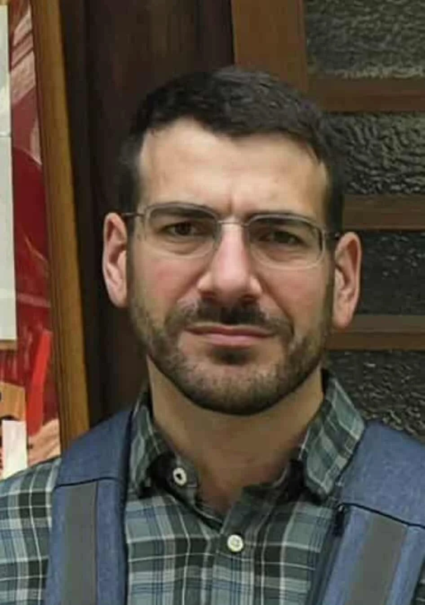

# Cassius

---

## 📊 Core Statistics (Level 1)

### Attributes & Modifiers

| Stat    | Value     | Modifier | Calculation / Source           |
| :------ | :-------- | :------- | :----------------------------- |
| **STR** | [Pending] | [TBD]    | To be determined by the Oracle |
| **DEX** | [Pending] | [TBD]    | To be determined by the Oracle |
| **CON** | [Pending] | [TBD]    | To be determined by the Oracle |
| **INT** | [Pending] | [TBD]    | To be determined by the Oracle |
| **WIS** | [Pending] | [TBD]    | To be determined by the Oracle |
| **CHA** | [Pending] | [TBD]    | To be determined by the Oracle |

### Combat Statistics

- **Armor Class:** [Pending]
- **Hit Points:** [Pending]
- **Speed:** 30 ft.
- **Initiative:** [Pending]

### Saving Throws & Skills

| Save    | Bonus | Skill          | Bonus     |
| :------ | :---- | :------------- | :-------- |
| **STR** | [TBD] | **Acrobatics** | [Pending] |
| **DEX** | [TBD] | **Athletics**  | [Pending] |
| **CON** | [TBD] | **Insight**    | [Pending] |
| **INT** | [TBD] | **Stealth**    | [Pending] |
| **WIS** | [TBD] | **Survival**   | [Pending] |

> **Passives:** Passive Perception: [Pending] | Passive Insight: [Pending]

---

## ✨ Personality & Traits

Cassius is a man of intense moral conviction. He doesn't just believe in his faith; he lives it with an intensity that can be overwhelming to those around him. His judgment is sharp and often public, making him well-known for his unscheduled sermons and uncompromising stance on the divine laws of Urusha.

## 📜 Lore & History

### I. Origins: The City of Urusha

Cassius hails from Urusha, a land synonymous with technological advancement and organized crime. This "Las Vegas" style environment is governed by the twin Gods Hurun and Nurun, whose influence permeates every party, street corner, and laboratory in the city.

### II. The Cleric's Calling

In a land of machines and shadows, Cassius found his purpose in the light of the Twin Gods. He serves as a moral anchor in a city that often forgets its conscience, standing ready to deliver judgment on those who stray too far from the path.

### III. Divine Audit

_Current Status: Cassius's spiritual records are currently being audited by a very confused deity._

## ⚔️ Action Menu & Techniques

**Technique Attack Bonus:** [Pending] | **Technique Save DC:** [Pending]

### Core Skills

- **Divine Intervention (Urusha Style)**
- **Moral Judgment/Sermons**

### Cantrips & Magic

- **Twin God Blessings** (Mechanics pending review)

### Techniques - Ranged

- **Hurun's Light:** [Locked]
- **Nuron's Shadow:** [Locked]

---

## 🧬 Race & Background Features

### HUMAN/URUSHAN

- **Tech Affinity:** Familiarity with Urushan technological advancements.
- **Urban Survival:** Proficiency in navigating organized crime territories.

### CLERIC (Background)

- **Divine Channeling:** Access to Hurun and Nurun's specific grievances.
- **Languages:** [Pending]

---

## 👁️ Sensory Mechanics

_Cassius is highly attuned to "Moral Vibrations"—the spiritual weight of a location or person._

---

## 📈 Progression & End-Game Stats (PRELIMINARY)

### KI & TECHNIQUE POINT PROGRESSION TABLE

_(Data currently being archived by the Urusha Temple)_

| LEVEL | BASE KI | KI LOST | FINAL KI | TECH PTS | TECHNIQUES KNOWN |
| :---- | :------ | :------ | :------- | :------- | :--------------- |
| 1     | 0       | 0       | 0        | 0        | 0                |
| ...   | ...     | ...     | ...      | ...      | ...              |

### VIII. FINAL STAT BLOCK (LEVEL 20)

_(To be updated upon completion of the campaign)_
