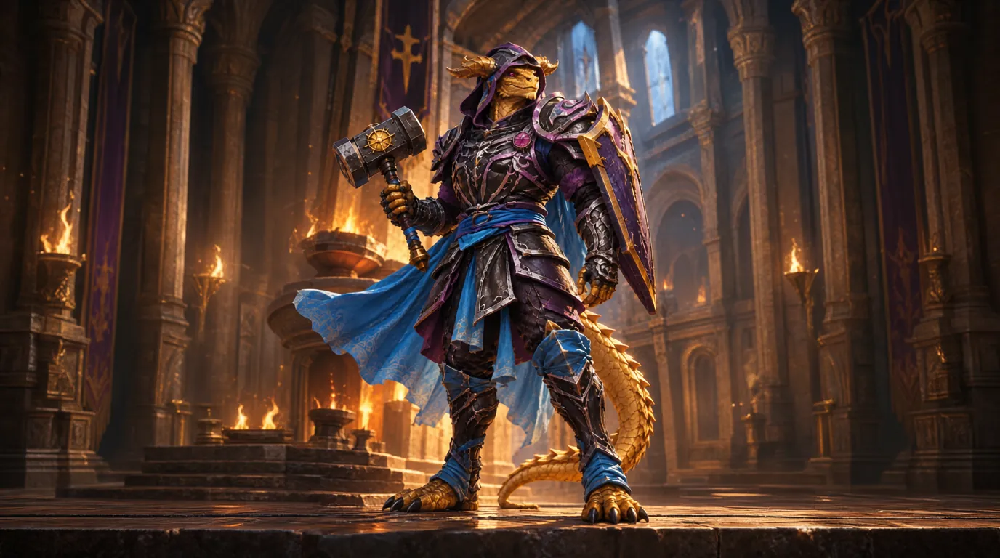

# Cassius - Cleric (Level 1)

## 📊 Attributes, Modifiers, & Saving Throws

| Stat    | Value   | Modifier | Saving Throw |
| :------ | :------ | :------- | :----------- |
| **STR** | Pending | TBD      | TBD          |
| **DEX** | Pending | TBD      | TBD          |
| **CON** | Pending | TBD      | TBD          |
| **INT** | Pending | TBD      | TBD          |
| **WIS** | Pending | TBD      | TBD          |
| **CHA** | Pending | TBD      | TBD          |

### Skills

| Skill                        | Bonus   |
| :--------------------------- | :------ |
| **Acrobatics** (DEX)      | Pending |
| **Animal Handling** (WIS) | Pending |
| **Arcana** (INT)          | Pending |
| **Athletics** (STR)       | Pending |
| **Deception** (CHA)       | Pending |
| **History** (INT)         | Pending |
| **Insight** (Wis)         | Pending |
| **Intimidation** (CHA)    | Pending |
| **Investigation** (INT)   | Pending |
| **Medicine** (WIS)        | Pending |
| **Nature** (INT)          | Pending |
| **Perception** (WIS)      | Pending |
| **Performance** (CHA)     | Pending |
| **Persuasion** (CHA)      | Pending |
| **Religion** (INT)        | Pending |
| **Sleight of Hand** (DEX) | Pending |
| **Stealth** (DEX)         | Pending |
| **Survival** (WIS)        | Pending |
| **Passive Perception**       | Pending |
| **Passive Insight**          | Pending |

## Combat Statisctics

| NAME              | DESCRIPTION            |
| :---------------- | :--------------------- |
| Hit Points        | Pending                |
| Armor Class       | Pending                |
| Initiative        | Pending                |
| Speed             | 30 ft.                 |
| Spellcasting      | Pending                |
| Technique Points  | Pending                |
| Proficiency Bonus | +2                     |
| Attack Bonus      | Pending                |
| Tech Save DC      | Pending                |
| Spell Save DC     | XX _(8 + WIS +2 PROF)_ |
| Spell ATK MOD     | X _(WIS +2 PROF)_      |

## ⚔️ Action Menu & Techniques

| Action     | Cost     | Range  | ATK or SAVE | Damage        |
| :--------- | :------- | ------ | ----------- | ------------- |
| Melee ATK  | 1 Action | Melee  | +X ATK      | xdx + x (???) |
| Ranged ATK | 1 Action | xx ft. | +X ATK      | xdx + x (???) |

## Class Features & Proficiencies

| Feature             |                                                                       |
| :------------------ | :-------------------------------------------------------------------- |
| Hit Dice            | 1d8 + CON                                                             |
| Armor Proficiency   | Light Armor, Medium Armor, Shields                                 |
| Weapon Proficiency  | Simple Weapons                                                        |
| Tools               | None                                                                  |
| Saving Throws       | WIS and CHA                                                           |
| Skills              | Choose 2: History, Insight, Medicine, Persuasion, Religion         |
| Divine Channeling   | Access to Hurun and Nurun's specific grievances                       |
| Moral Judgment      | Unscheduled sermons and uncompromising stance                         |
| Tech Affinity       | Familiarity with Urushan technological advancements                   |
| Cantrips Known      | 3                                                                     |
| Prepared Spells/Day | X _(WIS + Cleric LVL)_ Domain Spells do **not** count against this |
| Ritual Casting      | Can cast Ritual Spells                                                |
| Spellcasting Focus  | Your Holy Symbol                                                      |
| Divine Domain       | Knowledge, Life, LIght, Nature, Tempest, Trickery, or War          |
| Domain Spells       | TBD TBD                                                            |
| Channel Divinity    | Unlocks at LVL 2                                                      |

## 🧬 Race & Background Features

### Human/Urushan

### Cleric (Background)

- **ASI:** Pending
- **Tech Affinity:** Familiarity with Urushan technological advancements.
- **Urban Survival:** Proficiency in navigating organized crime territories.
- **Divine Channeling:** Access to Hurun and Nurun's specific grievances.
- **Languages:** Pending
- **Sensory Mechanics:** Highly attuned to "Moral Vibrations"—the spiritual weight of a location or person.

## Gear

|                                                          |     |
| :------------------------------------------------------- | :-- |
| Mace or Warhammer (if PROF)                              |     |
| Light Crossbow and Bolts x 20 or any Simple Weapon |     |
| Scale Mail, Leather Armor, or Chain Mail (if PROF)    |     |
| Shield and Holy Symbol                                   |     |
| Priest's Pack or Explorer's Pack                      |     |

## Actions, Techs, Spells (detail)

### Divine Intervention (Urusha Style)

### Moral Judgment/Sermons

### Cantrips & Magic

- **Twin God Blessings** (Mechanics pending review)

### Techniques - Ranged

- **Hurun's Light:** Locked
- **Nuron's Shadow:** Locked

## ✨ Personality & Traits

TBD

## 📜 Lore & History

### I. Origins: TBD

TBD

### II.

TBD

### III.

_Current Status: Cassius's spiritual records are currently being audited by a very confused deity._

## 📈 Cleric Progression Table

_(Data currently being archived by the Urusha Temple)_

| LVL | PROF BNS | FEATURES                                                                    | ELEMANCY | CANTRIPS KNOWN | 1st | 2nd | 3rd | 4th | 5th | 6th | 7th | 8th | 9th |
| :-- | :---------- | :-------------------------------------------------------------------------- | :------- | :---------------- | --- | --- | --- | --- | --- | --- | --- | --- | --- |
| 1   | +2          | Spellcasting Divine Domain                                               | TBD      | 3                 | 2   | -   | -   | -   | -   | -   | -   | -   | -   |
| 2   | +2          | Channel Divinity (1/rest) Divine Domain Feature                          | TBD      | 3                 | 3   | -   | -   | -   | -   | -   | -   | -   | -   |
| 3   | +2          | -                                                                           | TBD      | 3                 | 4   | 2   | -   | -   | -   | -   | -   | -   | -   |
| 4   | +2          | Ability Score Improvement                                                   | TBD      | 4                 | 4   | 3   | -   | -   | -   | -   | -   | -   | -   |
| 5   | +3          | Destroy Undead (CR 1/2)                                                     | TBD      | 4                 | 4   | 3   | 2   | -   | -   | -   | -   | -   | -   |
| 6   | +3          | Channel Divinity (2/rest) Divine Domain Feature                          | TBD      | 4                 | 4   | 3   | 3   | -   | -   | -   | -   | -   | -   |
| 7   | +3          | -                                                                           | TBD      | 4                 | 4   | 3   | 3   | 1   | -   | -   | -   | -   | -   |
| 8   | +3          | Ability Score Improvement Destroy Undead (CR 1) Divine Domain Feature | TBD      | 4                 | 4   | 3   | 3   | 2   | -   | -   | -   | -   | -   |
| 9   | +4          | -                                                                           | TBD      | 4                 | 4   | 3   | 3   | 3   | 1   | -   | -   | -   | -   |
| 10  | +4          | Divine Intervention                                                         | TBD      | 5                 | 4   | 3   | 3   | 3   | 2   | -   | -   | -   | -   |
| 11  | +4          | Destroy Undead (CR 2)                                                       | TBD      | 5                 | 4   | 3   | 3   | 3   | 2   | 1   | -   | -   | -   |
| 12  | +4          | Ability Score Improvement                                                   | TBD      | 5                 | 4   | 3   | 3   | 3   | 2   | 1   | -   | -   | -   |
| 13  | +5          | -                                                                           | TBD      | 5                 | 4   | 3   | 3   | 3   | 2   | 1   | 1   | -   | -   |
| 14  | +5          | Destroy Undead (CR 3)                                                       | TBD      | 5                 | 4   | 3   | 3   | 3   | 2   | 1   | 1   | -   | -   |
| 15  | +5          | -                                                                           | TBD      | 5                 | 4   | 3   | 3   | 3   | 2   | 1   | 1   | 1   | -   |
| 16  | +5          | Ability Score Improvement                                                   | TBD      | 5                 | 4   | 3   | 3   | 3   | 2   | 1   | 1   | 1   | -   |
| 17  | +6          | Destroy Undead (CR 4) Divine Domain Feature                              | TBD      | 5                 | 4   | 3   | 3   | 3   | 2   | 1   | 1   | 1   | 1   |
| 18  | +6          | Channel Divinity (3/rest)                                                   | TBD      | 5                 | 4   | 3   | 3   | 3   | 3   | 1   | 1   | 1   | 1   |
| 19  | +6          | Ability Score Improvement                                                   | TBD      | 5                 | 4   | 3   | 3   | 3   | 3   | 2   | 1   | 1   | 1   |
| 20  | +6          | Divine Intervention Improvement                                             | TBD      | 5                 | 4   | 3   | 3   | 3   | 3   | 2   | 2   | 1   | 1   |

### VIII. FINAL STAT BLOCK (LEVEL 20)

_(To be updated upon completion of the campaign)_
