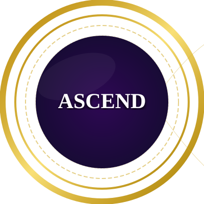
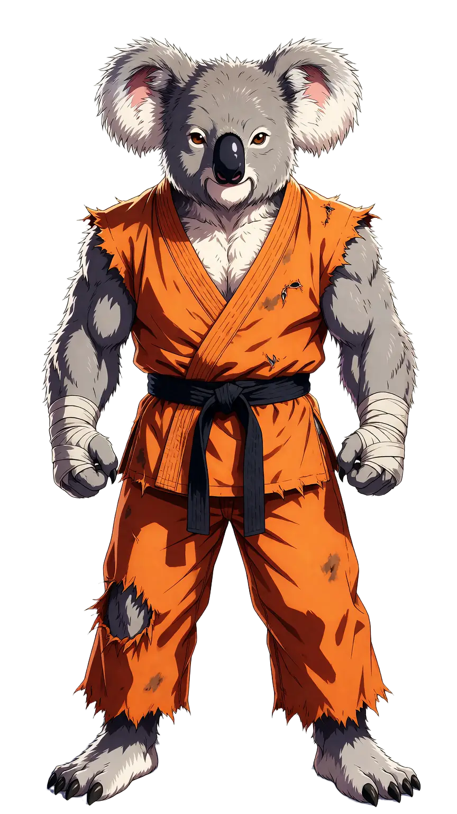
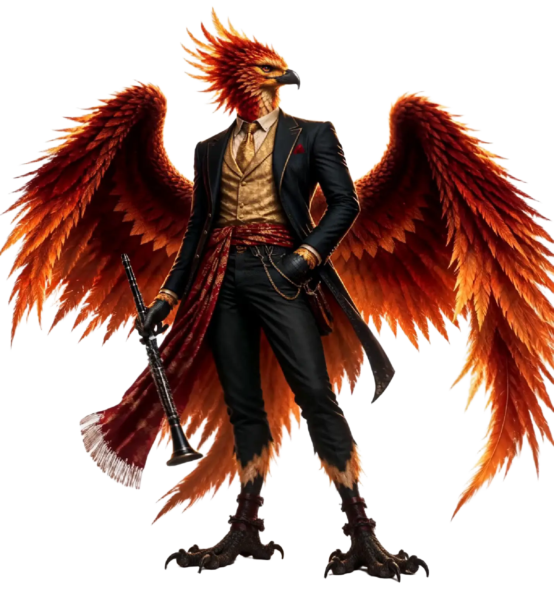
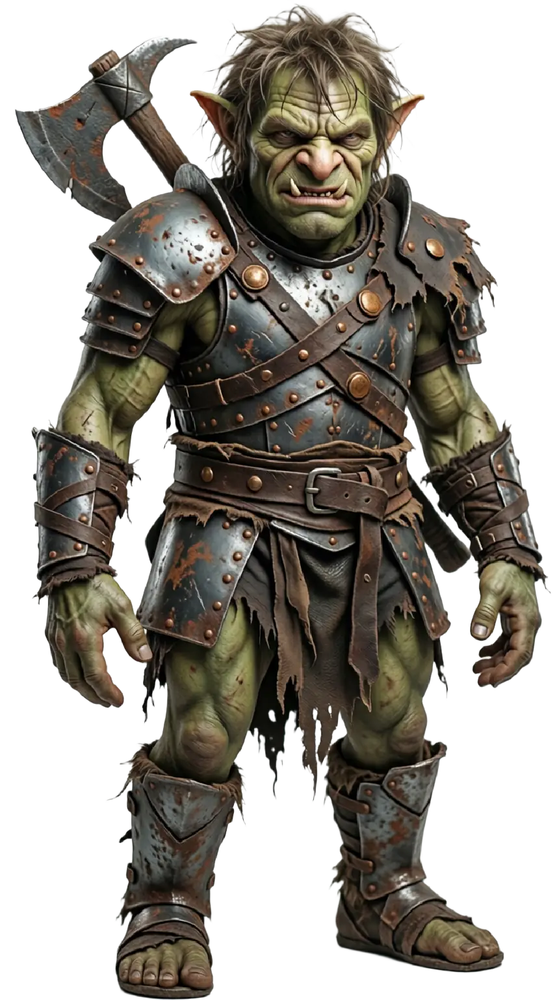

---
# https://vitepress.dev/reference/default-theme-home-page
layout: home

hero:
  name: "Ascension"
  text: "A website for use during our DnD Campaign."
  tagline: Git gud, noobz.
  image:
    src: ./docs/images/message.webp
    alt: Dice
---

<!-- Hero Actions Row -->

  

  
  
  

