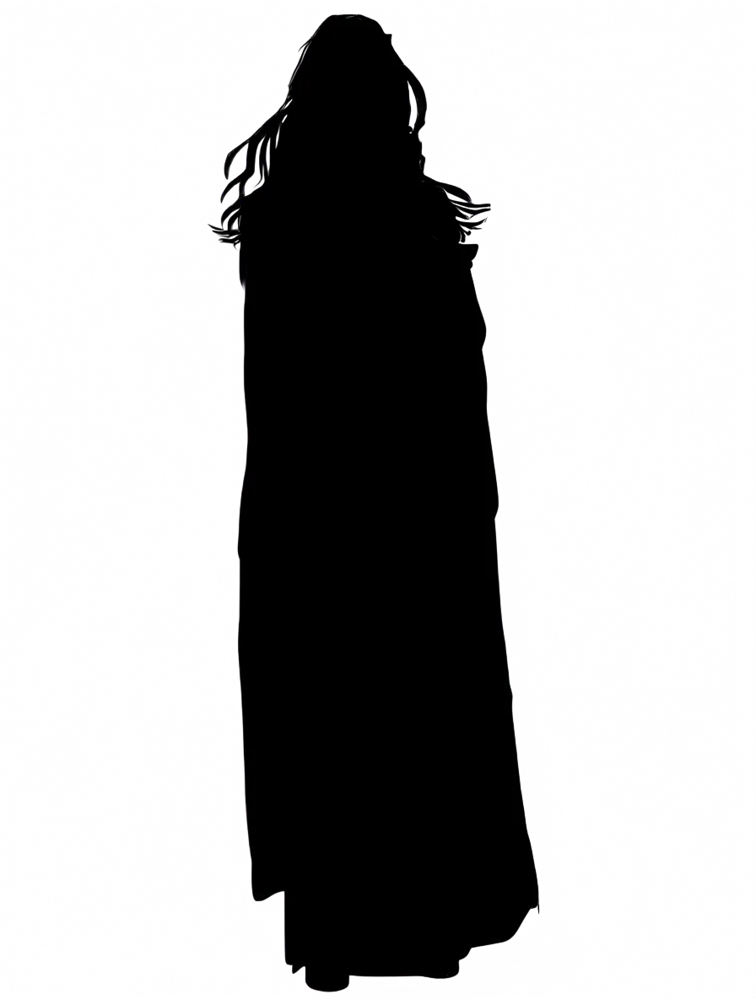
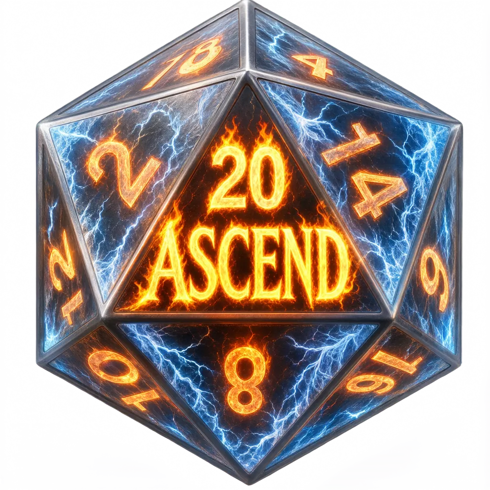
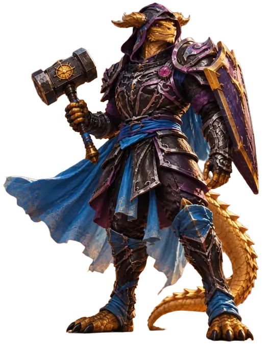
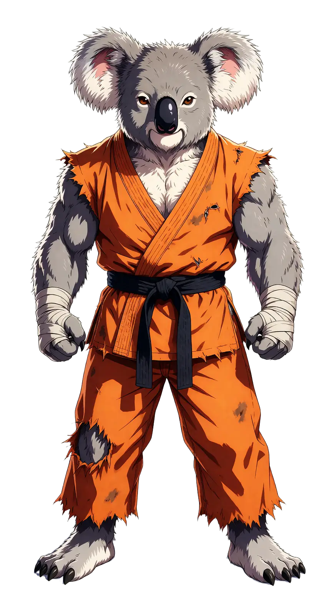
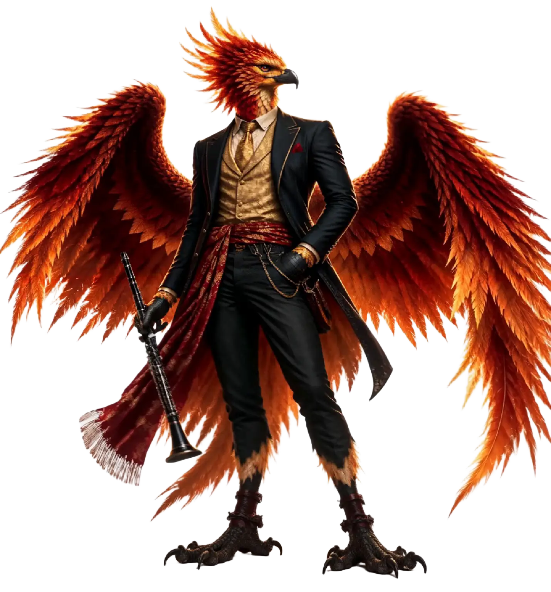
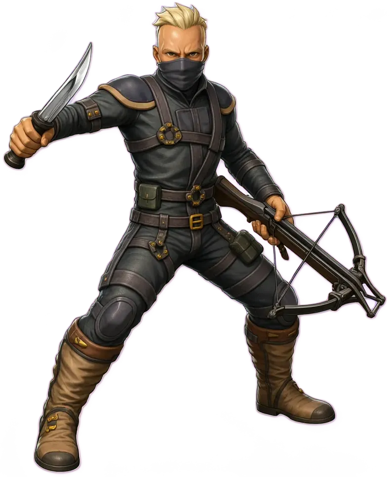
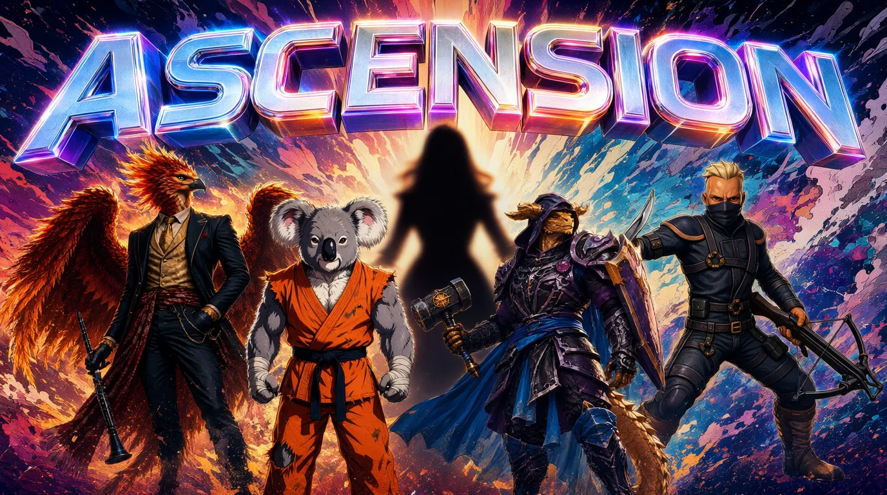

---
# https://vitepress.dev/reference/default-theme-home-page
layout: home

hero:
  name: "Ascension"
  text: "A website for use during our DnD Campaign."
  tagline: Git gud, noobz.
  image:
    src: /MessageSession1.webp
    alt: message
---

<!-- Hero Actions Row -->

  
  
    

  
  
    

